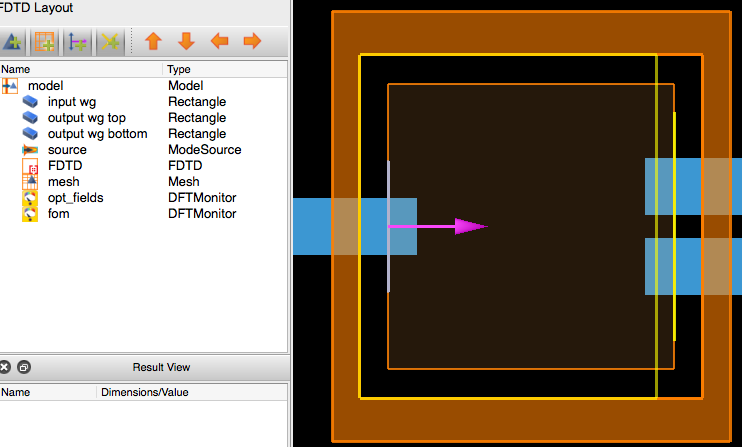

Tutorial
========

Anatomy of an optimization
--------------------------

Show a graph of the different object dependencies

* Optimization
    * Base simulation
    * Geometry
        * Materials
    * FOM
    * Optimizer
    * Plotter

Splitter Optimization
---------------------

.. raw:: html

    <video width="700" height="400" controls autoplay src="_static/splitter_vid.mp4"></video>

Let's have a look at the code in `examples/splitter/splitter_opt.py`

.. literalinclude:: ../examples/Ysplitter/splitter_opt_2D.py
  :language: python

Optimization Philosophy
-----------------------

The optimization setup works as such:
    - The user must provide a Lumerical script that serves as the basis of the optimization. It has everything required to build the problem except for the optimizable geometry, which is defined later in the python script and added in the simulation by the optimization itself.
    - The user then defines in python, using the classes of LumOpt:
        - An optimizable geometry
        - A Figure of Merit
        - An Optimization algorithm

Lumerical Setup Script
----------------------

Here is the setup script `examples/Ysplitter/splitter_base_TE_modematch.lsf` used in this example:

.. literalinclude:: ../examples/Ysplitter/splitter_base_TE_modematch.lsf

If the setup script is run in Lumerical FDTD (or alternatively replace `opt.run()` with `opt.make_base_sim()` in the previous
code snippet, here is a screenshot of what is built:

As one can see everything but the optimizable geometry is present. There are some additional requirements to this base
simulation however, beyond the strict minimum to perform the simulation.

Base Simulation Requirements:
~~~~~~~~~~~~~~~~~~~~~~~~~~~~~

SOURCES:

Sources MUST have 'source' in their name. This is because to run the adjoint simulation, all the classic forward simulation
sources will have to be deleted. The easiest way to do this is to identify by their name. IF YOU HAVE A SOURCE WITHOUT 'source',
IN ITS NAME YOUR OPTIMIZATION WILL MOST LIKELY FAIL.

OPTIMIZATION FIELD MONITOR:

A field Monitor named 'opt_fields' must cover the entire region where your optimizable geometry is succeptible to go. This
is because the fields in your optimizable geometry must be known in order to calculate the shape derivatives. Make sure that
even once the optimization gets going, your geometry will not go beyond this box. If it does the optimization will crash. Be
particularly carefull with splines, which can sometimes shoot well beyond their knots.

MESH:

In the same way as the optimization field monitor above, a mesh refinement region should be placed over the region where the
geometry is succeptible to go. This is to ensure that the mesh does not change during the optimization, which would also cause
the optimization to crash.

Co-optimization
---------------

The + operator can be used between two optimization objects that use the same parameters. This is for the moment the only way
to do multi-wavelength optimization for example.

An example of this can be seen in `examples/Ysplitter/robust_coupler.py` where a the performance of a coupler is optimized
for robustness: the figure of merit is the sum of the figures of merit for the nominal geometry, and a geometry with a 25nm extra bias.

.. literalinclude:: ../examples/Ysplitter/robust_coupler.py
  :language: python

which yields:

.. raw:: html

    <video width="700" height="400" controls autoplay src="_static/robust_splitter_vid.mp4"></video>

